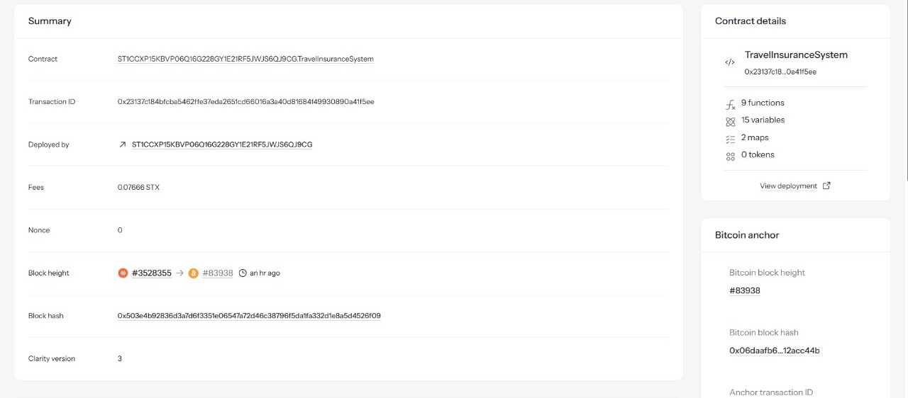

# RentableNFT Marketplace

## Project Description

RentableNFT Marketplace is a decentralized smart contract built on the Stacks blockchain using Clarity. It enables users to rent out their NFTs (gaming items, metaverse assets, utility tokens) in a secure and automated manner. The contract manages NFT escrow, rental payments, and ensures the NFT is returned to the owner after the rental period, eliminating the need for intermediaries.

## Project Vision

Our goal is to create a transparent, trustless, and user-friendly NFT rental ecosystem. We aim to:

- **Empower NFT Owners**: Monetize digital assets by renting them out securely
- **Simplify Rentals**: Automate the rental process with smart contracts and escrow
- **Ensure Security**: NFTs are held in escrow and returned automatically after rental
- **Promote Transparency**: All transactions and rental terms are recorded on-chain
- **Enable Innovation**: Lay the foundation for advanced NFT utility and sharing models

## Future Scope

The RentableNFT Marketplace is designed for extensibility. Planned enhancements include:

### Phase 2 - Advanced Rental Features
- **Partial Rental Periods**: Support for early returns and dynamic pricing
- **Batch Rentals**: Rent multiple NFTs in a single transaction
- **Reputation System**: Track renter reliability and owner responsiveness

### Phase 3 - Ecosystem Integration
- **Cross-Contract Rentals**: Support for NFTs from multiple contracts
- **Marketplace UI**: Web interface for browsing and managing rentals
- **Analytics Dashboard**: Insights into rental activity and asset utilization

### Phase 4 - Community & Governance
- **DAO Governance**: Community-driven decisions on rental terms and fees
- **Reward System**: Incentives for active renters and owners
- **Insurance Layer**: Optional coverage for lost or damaged NFTs

## Core Functions

### 1. Create Rental Listing
- **Escrow Transfer**: NFT is transferred to contract for secure holding
- **Custom Terms**: Owner sets rental price and duration
- **Listing Management**: Track active and inactive listings

### 2. Rent NFT Item
- **Payment Handling**: Renter pays the specified price to the owner
- **NFT Transfer**: NFT is transferred from escrow to the renter
- **Rental Record**: Rental details are stored on-chain

### 3. Return Rented Item
- **Automated Return**: NFT is transferred back to the owner after rental period
- **Reactivation**: Listing can be reactivated for future rentals

## Technical Features

- **Escrow Mechanism**: NFTs are securely held by the contract during rentals
- **Error Handling**: Comprehensive error codes for robust validation
- **Read-Only Queries**: Functions to fetch listings and rental details
- **Counters**: Track next available listing and rental IDs

## Contract Address Details

- **Network**: Stacks Mainnet/Testnet
- **Contract Name**: RentableNFT Marketplace
- **Contract Address**: ST1CCXP15KBVPQ061GQ228GY1E12RF5JWJ56QJ9CG.TravelInsuranceSystem
- **Transaction ID**: 0x23137d184bfcbas5426f73eda265cd68016a3a40d8168449930890a41f5ee
- **Block Height**: #3528355
- **Deployment Date**: August 26, 2025

---

*RentableNFT Marketplace is part of the evolving NFT utility ecosystem on Stacks, leveraging Bitcoin security for trustless digital asset management. Join us in building the future of NFT rentals.*